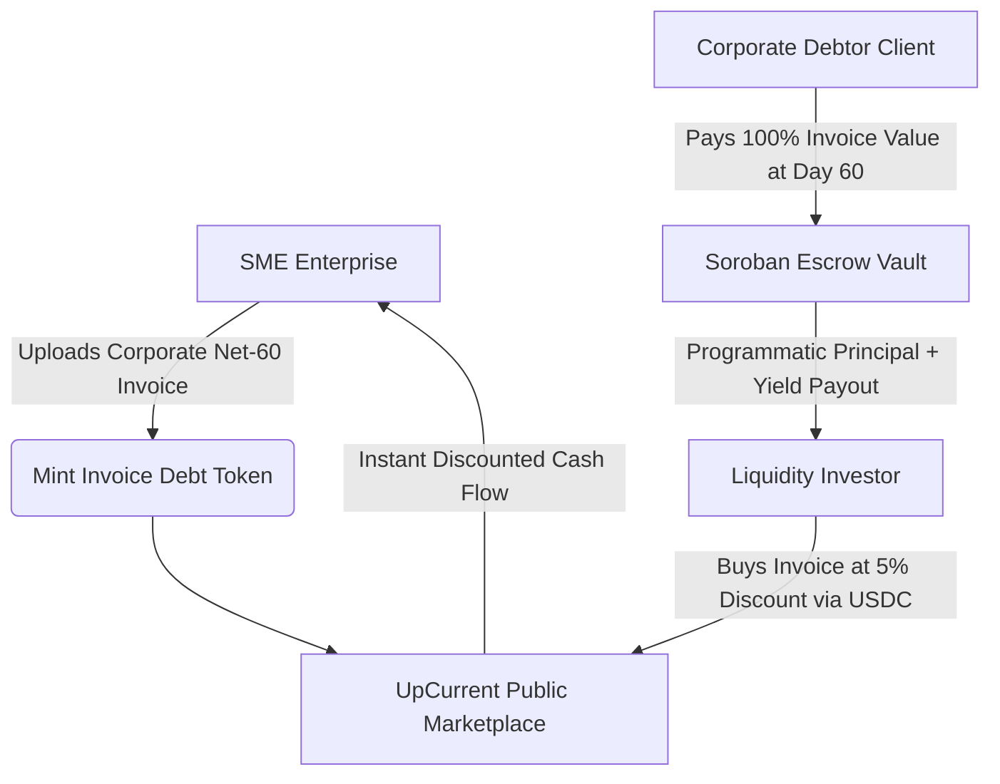

# UpCurrent 🌊

> **Decentralized Invoice Factoring & Trade Finance on Stellar.** Empowering small-to-medium enterprises (SMEs) to unlock immediate liquidity by tokenizing unpaid B2B invoices into yield-bearing escrow assets backed by Soroban smart contracts.

[](https://stellar.org)
[](https://react.dev)
[](https://www.rust-lang.org/)
[](LICENSE)

---

## 🎯 The Problem & Market Opportunity

Small and Medium Enterprises (SMEs) are the backbone of global trade, yet they face severe operational cash flow bottlenecks due to standard Net-30/60/90 day corporate invoice payout terms. Traditional bank invoice factoring is heavily paper-based, slow, and expensive — effectively locked off from micro-businesses requiring short-term cash flow to fulfill payroll or inventory requirements.

**UpCurrent** democratizes invoice financing. By bridging Real-World Assets (RWA) with decentralized finance primitives, businesses can mint verified corporate invoices as tokenized debt records on Stellar. Global liquidity providers (investors) buy these invoices at a minor discount rate, funding the business instantly in stablecoins ($USDC / $EURC$). Corporate debtors settle balances directly to an automated, non-custodial Soroban escrow wrapper, programmatically delivering predictable, yield-bearing rewards back to investors.

---

## ✨ Key Features

- **Invoice Tokenization Pipeline:** A seamless frontend wizard letting businesses upload structured ledger summaries and issue an automated on-chain debt claim token.
- **Dynamic Yield Discount Calculator:** Interactive front-end tools computing automated internal rates of return (IRR) based on risk tier adjustments, financing timelines, and discount rates.
- **Dual Portal Interface:**
  - *SME Dashboard:* Track immediate capital injections, manage incoming trade ledgers, and manage client reminders.
  - *Investor Desk:* Discover fractional debt opportunities, view localized asset maturity countdown graphics, and claim mature pool settlements.
- **Soroban Dispute-Lock Logic:** Capital assets remain held in public, immutable escrow environments until contract criteria or verification handshakes trigger auto-distribution.

---

## 🏗️ Architecture & Protocol Design

UpCurrent coordinates off-chain document tracking and on-chain capital allocation into a single unified frontend workflow.



### Stellar Ecosystem Frameworks Utilized

- **Soroban Smart Contracts (Rust):** Houses multi-party balance settlement matrices, time-locked debt maturities, and automated fraction payouts.
- **Stellar Wallets Kit:** Implements multi-wallet interfaces for cross-device authentication (Freighter, WalletConnect, Lobstr).
- **Horizon API Indexers:** Listens natively to state changes to stream real-time pool fills and contract completion data straight to the user client.

---

## 🛠️ Technical Stack & Project Setup

- **Frontend Ecosystem:** React 19, TypeScript, TailwindCSS, Vite
- **Blockchain Communication:** `@stellar/stellar-sdk`, `@stellar/wallets-kit`
- **Smart Contract Tooling:** Rust, Soroban CLI v21+

### Installation & Local Sandbox

Clone the repository and install frontend configurations:

```bash
git clone https://github.com/yourusername/upcurrent.git
cd upcurrent
npm install
```

### Smart Contract Development

Build the Soroban smart contracts:

```bash
cd contracts
make install-deps  # First time only
make build
make test
```

Generate local smart contract interfaces using the Soroban compiler:

```bash
# From the contracts directory
make bindings
```

This will generate TypeScript bindings at `./src/contracts/upcurrent/`

For detailed contract development instructions, see [contracts/README.md](./contracts/README.md) and [contracts/QUICKSTART.md](./contracts/QUICKSTART.md).

### Frontend Development

Spin up the localized developer instance:

```bash
npm run dev
```

---

## 🚀 SCF Milestone Roadmap (Build Award Open Track)

Aligned directly with the Stellar Community Fund (SCF) v7.0 4-tranche, execution-based funding model, UpCurrent's roadmap focuses aggressively on producing a mainnet-viable, highly intuitive end-user environment.

### 🔹 Tranche #0: System Bootstrap & Architecture Onboarding (10%)

- Initialize development environment using clean `stellar contract init` patterns.
- Design complete UI component architecture layouts covering the dual SME/Investor dashboards.

**Deliverable:** Public GitHub repository with modular component wiring and verified wallet initialization connections.

### 🔹 Tranche #1: Core Escrow Protocol & Tech MVP (20%)

- Deploy core Soroban Rust factoring smart contracts to Stellar Testnet.
- Build the invoice minting asset wizard and integrate simple contract funding logic using Testnet assets.

**Deliverable:** End-to-end testnet sandbox capturing automated tokenized deposit states and basic withdrawals.

### 🔹 Tranche #2: Yield Analytics Engine & Testnet Expansion (30%)

- Incorporate detailed interactive return data matrices into the Investor Desk UI.
- Build out automated Horizon indexer logic to track real-time contract expiration flags and state changes from the frontend.

**Deliverable:** Robust, publicly accessible Testnet application featuring complete documentation and real-time transaction simulators.

### 🔹 Tranche #3: UX-Ready Verified Mainnet Launch (40%)

- Refine application accessibility, implement clear transactional loading frameworks, and validate mobile responsive configurations.
- Push core contracts to Stellar Mainnet alongside verification badges and live onboarding tutorials for target business entities.

**Deliverable:** Production-grade, Mainnet-deployed RWA invoice factoring platform validated for ease of use, zero-friction client routing, and absolute ecosystem discovery.

---

## 📄 License

Distributed under the MIT License. See [LICENSE](LICENSE) for details.
